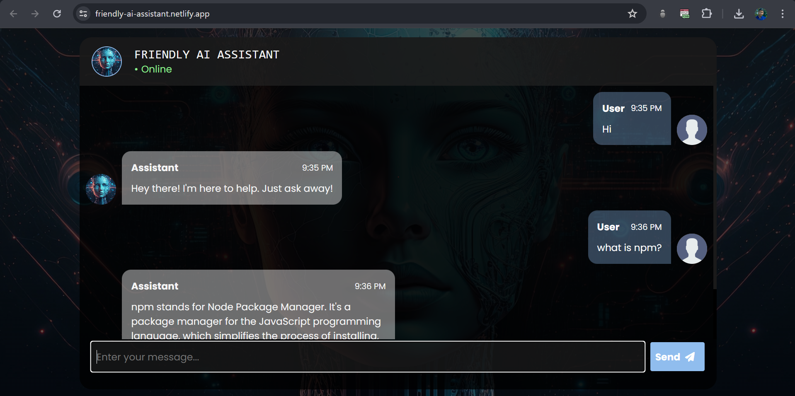
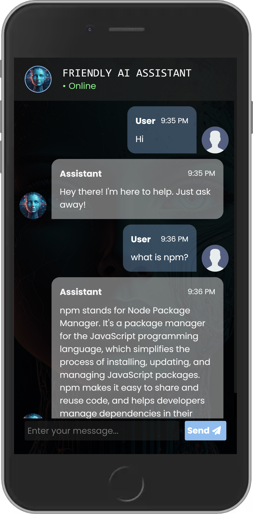

# Friendly AI Assistant
Welcome to the Friendly AI Assistant repository! This chat app provides concise and friendly answers to user queries. Built using HTML, CSS, and Vanilla JavaScript, with the assistance of Vite and Gemini API, this app is designed to be responsive across all devices. 🤖📱


## Table of Contents

- [Description](#description)
- [Preview](#preview)
- [Demo](#demo)
- [Features](#features)  <!-- Add Features Section -->
- [Technologies Used](#technologies-used)
- [Usage](#usage)
- [Acknowledgments](#acknowledgments)
- [Contact](#contact)

---

## Description

The Friendly AI Assistant is a chat app designed to provide users with concise and friendly answers to their queries. Developed using HTML, CSS, and Vanilla JavaScript, with support from Vite and Gemini API, this app ensures a responsive experience across all devices. Users can interact with the AI to ask questions and receive clear responses. The app includes robust error handling to maintain smooth functionality. Integration with Gemini 1.0 Pro API enhances response accuracy, while chat history tracking enables the provision of relevant answers based on previous interactions. 🚀💬

---

## Preview

### Desktop Preview


### Mobile Preview


---


## Demo

### [Link to Live Demo](https://friendly-ai-assistant.netlify.app/)

You can see the project in action by visiting the [live demo](https://friendly-ai-assistant.netlify.app/).

---

## Features

Here are some key features of this app:

- *🗣 Interactive Chat:* Chat with the AI and get friendly responses.
- *📝 Concise Answers:* Get clear and to-the-point responses to your queries.
- *🛠 Error Handling:* Smoothly manages unexpected errors.
- *📱 Responsive Design:* Works well on all devices.
- *🚀 Gemini 1.0 Pro API Integration:* Enhanced capabilities and accurate responses.
- *📜 Chat History:* Keeps track of previous interactions for relevant answers.

---

## Technologies Used

- HTML
- CSS
- Vanilla JavaScript
- npm
- Gemini API
---

## Usage

To set up and run this project locally, make sure you have Node.js installed on your machine. Then, follow these steps:

1. *Clone Repository:* Clone this repository to your local machine using the following command:
  ``` 
   git clone https://github.com/ManikMaity/Friendly-AI-Assistant.git
```
2. *Install Dependencies:* Navigate to the project directory and install dependencies using npm:
```   
   cd Friendly-AI-Assistant
   npm install
   ```

3. *Run Development Server:* Start the development server using Vite:
  ``` 
   npm run dev
```
4. *Open in Browser:* Open your browser and navigate to http://localhost:3000 to view the app.

5. *Enter Gemini API Key:* After opening the app in your browser, a prompt will appear asking for your Gemini API Key. Enter your API Key in the text area provided. [Get Your Gemini API Key](https://aistudio.google.com/app/apikey).

Once you've entered your API Key, you can start using the Friendly AI Assistant chat app to ask questions and receive responses.👨‍💻


---

## Acknowledgments

This project wouldn't be possible without the following:

[Gemini API](https://ai.google.dev/gemini-api/docs/get-started/web)

---

## Contact

- Manik Maity -[manikmaity010@gmail.com]
- [My LinkedIn](https://www.linkedin.com/in/manikmaity/)

---

**Note**: This project is for educational and demonstration purposes. All assets used in the project are belongs to its respective owner, I used it for educational purpose. It is not affiliated with or endorsed by anyone.